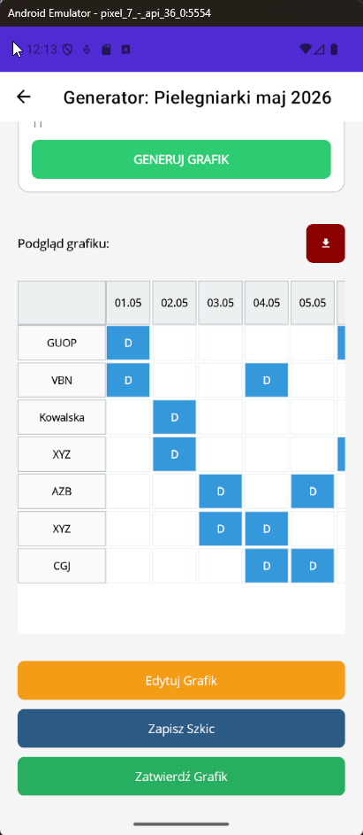
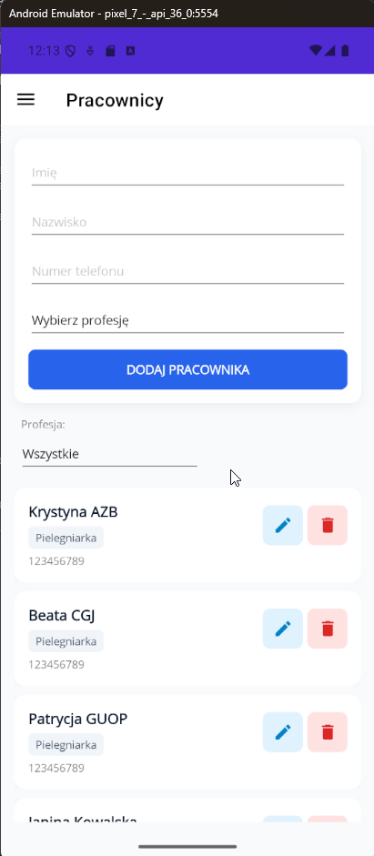
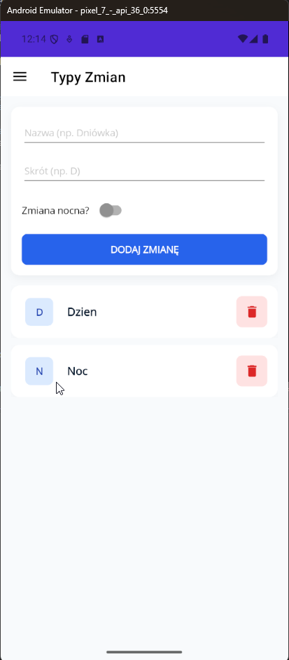
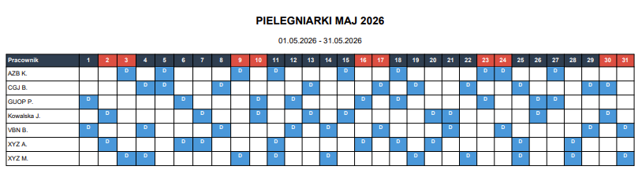

# EasySchedule 📅

EasySchedule to wieloplatformowa aplikacja do zarządzania grafikami i harmonogramami czasu pracy pracowników. Została stworzona przy użyciu **.NET MAUI** oraz oparta na założeniach **Clean Architecture** (Czystej Architektury). Aplikacja automatyzuje proces układania grafików, uwzględniając dostępność pracowników, urlopy, zapotrzebowanie na stanowiska oraz zasady prawa pracy (np. minimalny czas odpoczynku).

## ✨ Główne funkcje

* **Zarządzanie personelem:** Dodawanie i edycja danych pracowników oraz przypisywanie im odpowiednich zawodów (Professions).
* **Zarządzanie zmianami i wymaganiami:** Definiowanie typów zmian (Shift Types) oraz minimalnego zapotrzebowania na pracowników na danej zmianie.
* **Zarządzanie nieobecnościami (Time Off):** Rejestrowanie urlopów i innych zwolnień, które są automatycznie uwzględniane podczas generowania grafiku.
* **Automatyczne generowanie harmonogramów:** Wbudowany silnik generowania grafików (Schedule Generator) oparty na zbiorze elastycznych reguł:
  * 🛑 `MaxConsecutiveDaysRule` - Zapobiega pracy przez zbyt wiele dni z rzędu.
  * 🛌 `MinRestHoursRule` - Gwarantuje odpowiedni czas odpoczynku między zmianami.
  * 🌙 `NightShiftRule` - Zarządza specjalnymi obostrzeniami dla zmian nocnych.
  * 🌴 `TimeOffRule` - Blokuje przypisanie pracownika do zmiany w trakcie jego urlopu.
* **Eksport do PDF:** Możliwość wygenerowania gotowego harmonogramu do pliku PDF w celu łatwego udostępnienia pracownikom lub druku.
* **Wieloplatformowość:** Dzięki .NET MAUI aplikacja może zostać uruchomiona na systemach Windows, macOS, Android oraz iOS.

## 📸 Zrzuty ekranu (Wygląd aplikacji)

Interfejs aplikacji został zaprojektowany z myślą o prostocie i czytelności, wykorzystując natywne kontrolki systemu dzięki **.NET MAUI**. Poniżej znajduje się podgląd najważniejszych widoków aplikacji.

* **Zarządzanie harmonogramami**
<p align="center">
  <br>
  <i>Podgląd listy utworzonych grafików pracy wraz z ich obecnym statusem (np. Draft, Opublikowany).</i>
</p>

* **Generator grafiku**
<p align="center">
  <br>
  <i>Widok automatycznego generowania harmonogramu. To tutaj w tle uruchamiane są reguły (Rules) sprawdzające czas odpoczynku czy zapotrzebowanie na zmiany.</i>
</p>

* **Baza pracowników**
<p align="center">
  <br>
  <i>Panel zarządzania personelem.</i>
</p>

<details>
<summary><b>Kliknij tutaj, aby zobaczyć więcej zrzutów ekranu</b></summary>

* **Edycja Zmian (Shift Types):**
  <p align="center"></p>
* **Zarządzanie zawodami (Professions):**
  <p align="center"></p>
* **Zarządzanie urlopami (Time Off):**
  <p align="center"></p>
* **Wygenerowany grafik:**
  <p align="center"></p>
  
</details>

## 🏗️ Architektura projektu

Projekt został podzielony na cztery główne warstwy zgodnie z Clean Architecture:

1. **`EasySchedule.Domain` (Core)**
   Zawiera główne encje biznesowe (np. `Employee`, `Schedule`, `ShiftAssignment`, `TimeOff`), enumeratory oraz logikę stricte domenową. Nie posiada żadnych zależności od zewnętrznych bibliotek (poza .NET).
   
2. **`EasySchedule.Application`**
   Warstwa przypadków użycia. Zawiera interfejsy (serwisów i repozytoriów), logikę walidacji (`Validators`), zasady generowania grafików (`Rules`) oraz definicje operacji systemowych.

3. **`EasySchedule.Infrastructure`**
   Odpowiada za komunikację ze światem zewnętrznym. Implementuje repozytoria, obsługuje bazę danych przy pomocy **Entity Framework Core (SQLite)** oraz implementuje usługi zewnętrzne, takie jak generowanie plików PDF (`PdfExportService`).

4. **`EasySchedule.UI` (Presentation)**
   Wieloplatformowy interfejs użytkownika zbudowany w **.NET MAUI**. Wykorzystuje wzorzec **MVVM** (Model-View-ViewModel) z podziałem na Widoki (Views) i Modele Widoków (ViewModels).

## 🚀 Technologie

* **C# / .NET 10**
* **.NET MAUI** - UI framework dla Windows, macOS, iOS i Android
* **Entity Framework Core** - ORM
* **SQLite** - Lekka, lokalna baza danych
* **MVVM** - Wzorzec projektowy interfejsu użytkownika

## 🛠️ Uruchomienie projektu lokalnie

### Wymagania wstępne
* Zainstalowane środowisko **Visual Studio 2026** (lub JetBrains Rider)
* Zainstalowany workload **.NET Multi-platform App UI development** w instalatorze Visual Studio.

### Instrukcja krok po kroku
1. Sklonuj repozytorium:
   ```bash
   git clone https://github.com/twoja-nazwa/easyschedule.git
2. Otwórz plik rozwiązania `EasySchedule.slnx` w Visual Studio.
3. Ustaw projekt `EasySchedule.UI` jako projekt startowy (Set as Startup Project).
4. Wybierz platformę docelową *Android Emulator*.
5. Baza danych SQLite wygeneruje się i zaktualizuje automatycznie przy pierwszym uruchomieniu dzięki mechanizmowi migracji EF Core zawartemu w aplikacji.
6. Skompiluj i uruchom projekt (`F5`).

## 📂 Struktura Solucji

Projekt został zaprojektowany w oparciu o **Czystą Architekturę**, co zapewnia separację logiki biznesowej od technologii zewnętrznych (bazy danych, UI).

```text
EasySchedule/
├── EasySchedule.Domain/                # Warstwa Domenowa (Core)
│   ├── Entities/                       # Główne modele danych (Employee, Schedule, etc.)
│   └── Enums/                          # Typy wyliczeniowe (np. Statusy grafiku, Typy urlopów)
│
├── EasySchedule.Application/           # Warstwa Aplikacyjna (Logika biznesowa)
│   ├── Interfaces/                     # Interfejsy repozytoriów i serwisów
│   ├── Rules/                          # Logika reguł generowania grafiku (np. MinRestHoursRule)
│   └── Validators/                     # Walidacja danych wejściowych
│
├── EasySchedule.Infrastructure/        # Warstwa Infrastruktury (Implementacja)
│   ├── Persistance/                    # Konfiguracja bazy danych (EF Core, AppDbContext)
│   ├── Migrations/                     # Migracje bazy danych SQLite
│   ├── Repositories/                   # Implementacje dostępu do danych
│   └── Services/                       # Implementacje usług (Generator grafiku, Eksport PDF)
│
└── EasySchedule.UI/                    # Warstwa Prezentacji (.NET MAUI)
    ├── Views/                          # Strony aplikacji (XAML/C#)
    ├── ViewModels/                     # Logika UI (MVVM)
    ├── Converters/                     # Konwertery danych dla widoków
    ├── Resources/                      # Zasoby (Ikony, Style, Czcionki)
    ├── Platforms/                      # Specyficzny kod dla systemów (Android, iOS, Windows)
    └── MauiProgram.cs                  # Konfiguracja Dependency Injection i start aplikacji
